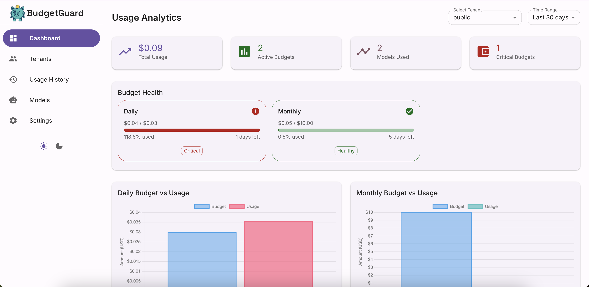

<div align="center">

#  BudgetGuard

[](https://opensource.org/licenses/Apache-2.0)
[](https://www.typescriptlang.org/)
[](https://nodejs.org/)
[](https://www.docker.com/)

**Stop surprise AI bills. Ship with confidence.**

A **FinOps control plane for AI APIs**—a drop‑in API gateway that enforces hard budgets, rate limits, and custom policy checks before any request reaches AI providers.

</div>

## ✨ Key Features

- 🛡️ **Hard Budget Enforcement** - Requests blocked the moment a tenant would exceed their limit
- ⚡ **Rate Limiting** - Per-minute rate limits with tenant-aware controls  
- 🏢 **Multi-tenant Ready** - Quotas, API keys, and budgets are tenant-scoped out of the box
- 📊 **Complete Audit Trail** - Every call logged to immutable UsageLedger for audit and chargeback
- 🔧 **Policy Engine** - Customizable OPA/Rego policies for advanced request filtering
- 🌐 **Multi-provider Support** - OpenAI, Anthropic Claude, Google Gemini APIs
- 🐳 **Self-hosted** - Docker-first deployment, keep your infrastructure and keys private
- ⚡ **Low Latency** - <100ms added latency to your AI API calls
- 📈 **Usage Analytics** - Built-in dashboard for monitoring and cost management
- 🎨 **Modern Dashboard** - React-based UI with Material Design 3, light/dark themes

---

## Why BudgetGuard?

| Pain                        | How BudgetGuard helps                                                                                |
| --------------------------- | ---------------------------------------------------------------------------------------------------- |
| **Unexpected invoices**     | Hard‑cap monthly or rolling budgets—requests are blocked the moment a tenant would exceed its limit. |
| **Runaway scripts & abuse** | Per‑minute rate limits and customizable OPA/Rego policies catch bad actors instantly.                |
| **FinOps black box**        | Every call is logged to an immutable **UsageLedger** table for audit, chargeback, and forecasting.   |
| **Multi‑tenant SaaS needs** | Quotas, API keys, and budgets are all **tenant‑aware** out of the box.                               |
| **Vendor lock‑in fears**    | Self‑hosted, Docker‑first, and <100 ms of added latency. Keep your infra (and keys) private.         |

---

## Quick Start (5 minutes)

1. **Clone & enter the repo**

   ```bash
   git clone https://github.com/budgetguard-ai/budgetguard-core.git
   cd budgetguard-core
   ```

2. **Install deps & build the policy bundle**

   ```bash
   npm install
   bash scripts/build-opa-wasm.sh
   ```

3. **Run migrations & seed demo data**

   ```bash
   npx prisma migrate dev
   npm run seed
   ```

4. **Configure secrets**
   Copy `.env.example` ➜ `.env` (or export manually):

   | Variable             | Description                                            |
   | -------------------- | ------------------------------------------------------ |
   | `OPENAI_KEY`         | Your OpenAI API key (for GPT models)                  |
   | `ANTHROPIC_API_KEY`  | Your Anthropic API key (for Claude models)            |
   | `GOOGLE_API_KEY`     | Your Google API key (for Gemini models)               |
   | `ADMIN_API_KEY`      | Key for admin routes                                   |
   | `MAX_REQS_PER_MIN`   | Default per‑tenant rate limit (use `0` for unlimited) |
   | `DEFAULT_BUDGET_USD` | Default tenant monthly budget                          |
   | `BUDGET_PERIODS`     | Comma‑separated budget windows (e.g. `monthly,weekly`) |

5. **Boot everything**

   ```bash
   docker compose up --build     # Postgres, Redis, API
   ```

6. **Launch the background worker** (new terminal)

   ```bash
   npm run worker
   ```

7. **Test the gateway**

   * Browse Swagger UI → [http://localhost:3000/docs](http://localhost:3000/docs)
  * Curl a response:

### Example Requests

Test the gateway with these sample `curl` commands:

```bash
curl -X POST http://localhost:3000/v1/responses \
   -H "Content-Type: application/json" \
   -H "Authorization: Bearer <OPENAI_KEY>" \
   -H "X-Tenant-Id: demo" \
   -H "X-API-Key: <TENANT_API_KEY>" \
   -d '{"model":"gpt-4.1","input":"hello"}'
```

```bash
curl -X POST http://localhost:3000/v1/chat/completions \
   -H "Content-Type: application/json" \
   -H "Authorization: Bearer <OPENAI_KEY>" \
   -H "X-Tenant-Id: demo" \
   -H "X-API-Key: <TENANT_API_KEY>" \
   -d '{"model":"gpt-4.1","messages":[{"role":"user","content":"hello"}]}'
```

That's it—you now have full budget & rate‑limit protection in front of your AI providers!

## 🎛️ Management Dashboard

BudgetGuard includes a modern React dashboard for easy management and monitoring:

### Features
- **System Overview** - Real-time health monitoring for database, Redis, and AI providers
- **Tenant Management** - Create, edit, and manage tenants with budget controls
- **Usage Analytics** - Track spending, request patterns, and model usage
- **Budget Management** - Set and monitor budgets across different time periods
- **API Key Management** - Generate and manage tenant API keys
- **Material Design 3** - Modern, responsive UI with light/dark theme support

### Access the Dashboard

Once your server is running, visit: **http://localhost:3000/dashboard**



*More screenshots and detailed dashboard documentation: [src/dashboard/README.md](src/dashboard/README.md)*

---

## Running in Production

1. **Set environment variables** (see [DEPLOYMENT.md](DEPLOYMENT.md) for complete guide)
2. **Start Postgres, Redis, and the API**:

   ```bash
   docker compose up --build -d
   ```
3. **Run the worker** in a separate process/container:

   ```bash
   npm run worker
   ```
4. **Monitor**: metrics and structured logs are exposed on `/metrics` and `/health` endpoints.

---

## API Reference

### Proxy Endpoints

| Method | Path                   | Description                        |
| ------ | ---------------------- | ---------------------------------- |
| `POST` | `/v1/chat/completions` | Forward to AI provider chat completions |
| `POST` | `/v1/responses`        | Forward to AI provider responses   |
| `GET`  | `/health`              | Liveness probe                     |

Required headers: `X-Tenant-Id`, `X-API-Key` (or rely on server‑side `OPENAI_KEY`). Usage is logged in `UsageLedger`.

### Admin Endpoints (auth via `X-Admin-Key`)

| Method | Path                        | Action           |
| ------ | --------------------------- | ---------------- |
| `POST` | `/admin/tenant`             | Create tenant    |
| `GET`  | `/admin/tenant/:id`         | Tenant info      |
| `POST` | `/admin/tenant/:id/budgets` | Set budgets      |
| `POST` | `/admin/tenant/:id/apikeys` | Generate API key |
| `PUT`  | `/admin/tenant/:id/ratelimit` | Set per-minute rate limit (0=unlimited) |
| `GET`  | `/admin/tenant/:id/ratelimit` | Get per-minute rate limit |

`rateLimitPerMin` set to `0` disables limiting for that tenant.

Full OpenAPI spec available at **/docs** once the service is running.

---

## Policy Engine

Policies are written in [Rego](https://www.openpolicyagent.org/). Edit `src/policy/opa.rego` and rebuild:

```bash
bash scripts/build-opa-wasm.sh
```

Override the bundle path with `OPA_POLICY_PATH`. Hot‑reloading is enabled in dev mode.

---

## Data Storage

| Component    | Purpose                                             |
| ------------ | --------------------------------------------------- |
| **Postgres** | Tenants, API keys, budgets, immutable `UsageLedger`, model pricing |
| **Redis**    | Cached budgets & rate‑limit counters (fast path)    |

Migrations (Prisma):

```bash
# local dev
npx prisma migrate dev

# production
npm run migrate
```

---

## Roadmap

* ✅ **Multi-provider support** (OpenAI, Anthropic, Google)
* 🔜 **Stripe cost back‑filling** for end‑to‑end showback
* 🔜 **Email / Slack budget alerts**
* 🔜 **Additional providers** (Mistral, Azure OpenAI, etc.)

---

## 📚 Documentation

- [**Quick Start Guide**](QUICKSTART.md) - Step-by-step tutorial for first-time users
- [**Dashboard Guide**](src/dashboard/README.md) - Management dashboard setup and features
- [**API Reference**](docs/api.md) - Complete API documentation with examples
- [**Architecture Overview**](docs/ARCHITECTURE.md) - System design and data flow
- [**Deployment Guide**](DEPLOYMENT.md) - Production deployment instructions
- [**Contributing Guide**](CONTRIBUTING.md) - How to contribute to the project

## Contributing

1. Fork & create a feature branch
2. Ensure `npm run test` passes
3. Open a PR—CI will lint, type‑check, and run the integration suite

See [CONTRIBUTING.md](CONTRIBUTING.md) for detailed guidelines. We follow the Contributor Covenant code of conduct.

---

## License

Apache License 2.0. See `LICENSE`.

---

<div align="center">

**BudgetGuard** — because your AI bills shouldn't keep you up at night.

Give us a ⭐ if this saved you money!

[Getting Started](QUICKSTART.md) • [Documentation](docs/) • [API Reference](docs/api.md) • [Contributing](CONTRIBUTING.md)

</div>
