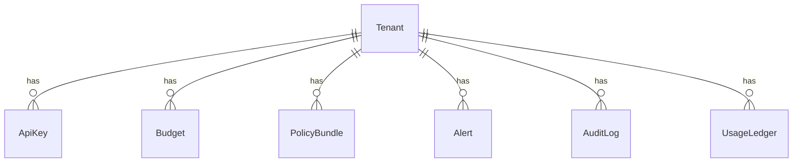

# budgetguard-core

## Rate-Limiting

The server applies a per-tenant sliding window limiter. Configure the maximum
number of requests per minute with the `MAX_REQS_PER_MIN` environment variable
(defaults to `100`). Identify tenants by sending an `X-Tenant-Id` header with
your requests.

## Quick Start

Run the stack with Postgres and Redis using Docker:

```bash
docker compose up --build
```

Then open a second terminal and run the worker that persists usage events:

```bash
npm run worker
```

To verify connectivity you can check the health endpoint:

```bash
curl http://localhost:3000/health
```

To inspect the database state run an interactive `psql` session against the
Postgres container:

```bash
docker compose exec postgres psql -U postgres -d budgetguard
```

## Development & Testing

Install dependencies and run the Prisma migrations:

```bash
npm install
npx prisma migrate dev
```

Run the server in watch mode and start the worker in another terminal:

```bash
npm run dev
npm run worker
```

Lint and test the codebase:

```bash
npm run lint
npm test
```

## Proxy Endpoints

BudgetGuard forwards OpenAI requests and logs usage locally. Set `OPENAI_KEY` in
your environment or send `X-OpenAI-Key` per request.

### `POST /v1/completions`

```bash
curl -X POST \
  -H "Content-Type: application/json" \
  -H "X-Tenant-Id: demo" \
  -d '{"model":"gpt-3.5-turbo","prompt":"hello"}' \
  http://localhost:3000/v1/completions
```

### `POST /v1/chat/completions`

```bash
curl -X POST \
  -H "Content-Type: application/json" \
  -H "X-Tenant-Id: demo" \
  -d '{"model":"gpt-3.5-turbo","messages":[{"role":"user","content":"hi"}]}' \
  http://localhost:3000/v1/chat/completions
```

### `GET /health`

```bash
curl http://localhost:3000/health
```

Responses are proxied back and an entry is written to the `UsageLedger` table:

```
ts | tenant | route | usd | promptTok | compTok
```

## Admin API

Authenticate using the `X-Admin-Key` header set to `ADMIN_API_KEY`.
These endpoints allow automation and management via scripts or a future UI.

### `POST /admin/tenant`

Create a tenant.

### `GET /admin/tenant`

List tenants.

### `GET /admin/tenant/:tenantId`

Tenant details.

### `POST /admin/tenant/:tenantId/budgets`

Create or update budgets for a tenant. Example body:

```json
{ "budgets": [{ "period": "monthly", "amountUsd": 10 }] }
```

### `GET /admin/tenant/:tenantId/budgets`

List budgets for a tenant.

### `GET /admin/tenant/:tenantId/usage`

Current usage totals.

### `PUT /admin/budget/:budgetId`

Update a budget.

### `DELETE /admin/budget/:budgetId`

Delete a budget.

## Cost Calculation

BudgetGuard counts tokens using `tiktoken` and multiplies by the per-model
OpenAI pricing. The default table:

| Model         | Prompt / 1K | Completion / 1K |
| ------------- | ----------- | --------------- |
| gpt-3.5-turbo | $0.001      | $0.002          |
| gpt-4         | $0.03       | $0.06           |
| gpt-4-turbo   | $0.01       | $0.03           |

The total USD for a request is stored in Redis and persisted to Postgres by the
worker. Configure a monthly cap with `MAX_MONTHLY_USD` or use `BUDGET_PERIODS`
to enforce daily, weekly, monthly, or custom windows simultaneously.

## Budget

Set `DEFAULT_BUDGET_USD` to limit spend for all tenants. Provide one or more
periods via `BUDGET_PERIODS` (e.g. `daily,monthly`) and specify budgets for each
with variables like `BUDGET_DAILY_USD` or `BUDGET_MONTHLY_USD`. For custom
ranges also supply `BUDGET_START_DATE` and `BUDGET_END_DATE`. Override tenants
with `BUDGET_<PERIOD>_<TENANT>` variables. When a request would exceed any
budget, the server responds with:

```json
HTTP/1.1 402 Payment Required
{"error":"Budget exceeded"}
```

### Example

```bash
curl -X POST \
  -H "Content-Type: application/json" \
  -H "X-Tenant-Id: demo" \
  -d '{"model":"gpt-3.5-turbo","prompt":"hello"}' \
  http://localhost:3000/v1/completions
```

### Example Request

```bash
curl -X POST \
  -H "Content-Type: application/json" \
  -H "X-Tenant-Id: demo" \
  -d '{"model":"gpt-3.5-turbo","prompt":"hello"}' \
  http://localhost:3000/v1/completions
```

After a request is processed, the worker inserts a row into `UsageLedger`:

```
id | ts | tenant | route | usd | promptTok | compTok
```

## Policy Engine

BudgetGuard uses [Open Policy Agent](https://www.openpolicyagent.org/) to make
allow/deny decisions before forwarding requests. Policies are compiled to WASM
and evaluated at runtime. The default policy is located in
`src/policy/opa.rego` and can be extended to enforce custom rules.

### Building the Policy

Install the `opa` CLI and run the build script whenever the policy changes or
before starting the server/tests. On macOS you can install OPA via Homebrew:

```bash
brew install opa
```

For Linux and Windows, download the appropriate binary from the
[OPA releases](https://openpolicyagent.org/docs/latest/#install) page and place
it in your `PATH`. See the [official installation guide](https://openpolicyagent.org/docs/latest/#install)
for more details.

Once the CLI is installed, run the build script:

```bash
bash scripts/build-opa-wasm.sh
```

This compiles the policy to `src/policy/opa_policy.wasm` which the server loads
on startup. Run the script once before starting the server or running tests so
the WASM file is present. Set `OPA_POLICY_PATH` to override the location.

### Example Rego Policy

```rego
package budgetguard.policy

default allow = false

allow {
  input.usage < input.budget
}

deny_admin_after_hours {
  input.route == "/admin/tenant-usage"
  input.time > 20
}

allow {
  not deny_admin_after_hours
}
```

The policy receives an input object with `usage`, `budget`, `route`, `time`, and
`tenant` fields. If evaluation returns `true`, the request is allowed. Otherwise
the server responds with `403` and an error message.

## Schema & Data Model



Budgets, API keys, policy bundles, alerts and audit logs are scoped to a tenant.
Each UsageLedger entry references both the tenant name and its ID for
compatibility. Budgets track spend for daily, weekly, monthly or custom periods.

Example: query the remaining monthly budget for each tenant:

```sql
SELECT t.name, b.amountUsd - COALESCE(SUM(l.usd),0) AS remaining
FROM Tenant t
LEFT JOIN Budget b ON b.tenantId = t.id AND b.period = 'monthly'
LEFT JOIN UsageLedger l ON l.tenantId = t.id
GROUP BY t.name, b.amountUsd;
```

Run migrations in development with `npx prisma migrate dev` and deploy to
production with `npm run migrate`. The ERD below summarizes the relationships.
