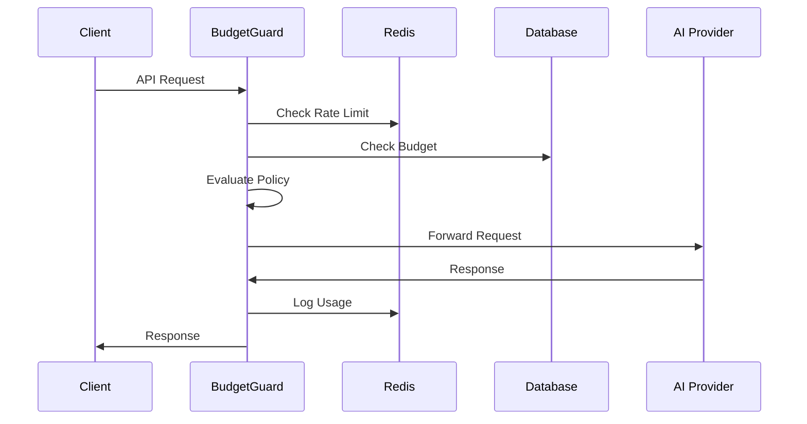

# BudgetGuard API Reference

<div align="center">

[](http://localhost:3000/docs)
[](#rest-endpoints)
[](#authentication)

Complete API documentation for BudgetGuard's FinOps control plane.

[Interactive Docs](http://localhost:3000/docs) • [OpenAPI JSON](http://localhost:3000/docs/json) • [Quick Start](#quick-start) • [Examples](#examples)

</div>

## 📋 Table of Contents

- [Quick Start](#quick-start)
- [Authentication](#authentication)
- [Proxy Endpoints](#proxy-endpoints)
- [Admin API](#admin-api)
- [Health & Monitoring](#health--monitoring)
- [Error Handling](#error-handling)
- [Rate Limiting](#rate-limiting)
- [Examples](#examples)
- [SDKs & Libraries](#sdks--libraries)

## 🚀 Quick Start

### Base URL
```
Production: https://your-budgetguard.com
Development: http://localhost:3000
```

### Interactive Documentation
Start BudgetGuard and visit the Swagger UI:
```bash
# Start BudgetGuard
npm run dev

# Open interactive docs
open http://localhost:3000/docs
```

### First API Call
```bash
curl -X POST http://localhost:3000/v1/chat/completions \
  -H "Content-Type: application/json" \
  -H "Authorization: Bearer $OPENAI_KEY" \
  -H "X-Tenant-Id: demo" \
  -H "X-API-Key: $TENANT_API_KEY" \
  -d '{
    "model": "gpt-4.1",
    "messages": [{"role": "user", "content": "Hello!"}],
    "max_tokens": 100
  }'
```

## 🔐 Authentication

### API Key Types

| Key Type | Header | Purpose | Scope |
|----------|--------|---------|--------|
| **Admin Key** | `X-Admin-Key` | Administrative operations | Full system access |
| **Tenant Key** | `X-API-Key` | Tenant-specific operations | Single tenant |
| **Provider Key** | `Authorization: Bearer` | AI provider access | Per-provider |

### Authentication Examples

```bash
# Admin operations
curl -H "X-Admin-Key: admin-key-123" \
     http://localhost:3000/admin/tenant

# Tenant operations  
curl -H "X-API-Key: tenant-key-456" \
     -H "X-Tenant-Id: my-tenant" \
     http://localhost:3000/v1/chat/completions

# Provider authentication
curl -H "Authorization: Bearer sk-openai-key" \
     -H "X-Anthropic-Key: sk-ant-key" \
     -H "X-Google-API-Key: google-key" \
     http://localhost:3000/v1/chat/completions
```

### Security Headers

```http
X-Admin-Key: your-admin-key-here
X-API-Key: tenant-specific-key
X-Tenant-Id: tenant-identifier
Authorization: Bearer provider-api-key
X-OpenAI-Key: sk-openai-key (alternative)
X-Anthropic-Key: sk-ant-key (alternative)  
X-Google-API-Key: google-key (alternative)
```

## 🔄 Proxy Endpoints

BudgetGuard proxies requests to AI providers with budget and policy enforcement.

### Chat Completions

**Endpoint:** `POST /v1/chat/completions`

Proxy chat completion requests to OpenAI, Anthropic, or Google.

```bash
curl -X POST http://localhost:3000/v1/chat/completions \
  -H "Content-Type: application/json" \
  -H "Authorization: Bearer $OPENAI_KEY" \
  -H "X-Tenant-Id: demo" \
  -H "X-API-Key: $TENANT_API_KEY" \
  -d '{
    "model": "gpt-4.1",
    "messages": [
      {"role": "system", "content": "You are a helpful assistant."},
      {"role": "user", "content": "What is the capital of France?"}
    ],
    "max_tokens": 150,
    "temperature": 0.7
  }'
```

**Supported Models:**
- **OpenAI**: `gpt-4.1`, `gpt-4.1-mini`, `gpt-4.1-nano`, `gpt-4o`, `gpt-4o-mini`, `o1`, `o1-mini`, `o3`, `o3-mini`, `o4-mini`, `codex-mini-latest`
- **Anthropic**: `claude-3-5-haiku-latest`, `claude-3-5-sonnet-latest`, `claude-opus-4-0`, `claude-sonnet-4-0`
- **Google**: `gemini-2.5-flash`, `gemini-2.5-pro-high`, `gemini-2.5-pro-low`, `gemini-2.0-flash`, `gemini-2.0-flash-lite`

### Legacy Responses

**Endpoint:** `POST /v1/responses`

Legacy endpoint for simple text responses.

```bash
curl -X POST http://localhost:3000/v1/responses \
  -H "Content-Type: application/json" \
  -H "Authorization: Bearer $OPENAI_KEY" \
  -H "X-Tenant-Id: demo" \
  -H "X-API-Key: $TENANT_API_KEY" \
  -d '{
    "model": "gpt-4.1",
    "input": "Explain quantum computing in simple terms"
  }'
```

### Request Flow



## 👑 Admin API

Administrative endpoints for managing tenants, budgets, and system configuration.

### Tenant Management

#### Create Tenant
```bash
curl -X POST http://localhost:3000/admin/tenant \
  -H "X-Admin-Key: $ADMIN_KEY" \
  -H "Content-Type: application/json" \
  -d '{
    "name": "ACME Corp",
    "description": "Enterprise customer",
    "rateLimitPerMin": 100,
    "budgets": [
      {
        "period": "monthly",
        "limitUsd": 1000,
        "startDate": "2025-01-01"
      }
    ]
  }'
```

**Response:**
```json
{
  "id": "123",
  "name": "ACME Corp",
  "description": "Enterprise customer",
  "rateLimitPerMin": 100,
  "createdAt": "2025-01-15T10:00:00Z",
  "updatedAt": "2025-01-15T10:00:00Z"
}
```

#### List Tenants
```bash
curl -H "X-Admin-Key: $ADMIN_KEY" \
     "http://localhost:3000/admin/tenant?limit=10&offset=0"
```

#### Get Tenant
```bash
curl -H "X-Admin-Key: $ADMIN_KEY" \
     http://localhost:3000/admin/tenant/123
```

#### Update Tenant
```bash
curl -X PUT http://localhost:3000/admin/tenant/123 \
  -H "X-Admin-Key: $ADMIN_KEY" \
  -H "Content-Type: application/json" \
  -d '{
    "name": "ACME Corporation",
    "rateLimitPerMin": 200
  }'
```

#### Delete Tenant
```bash
curl -X DELETE http://localhost:3000/admin/tenant/123 \
  -H "X-Admin-Key: $ADMIN_KEY"
```

### Budget Management

#### Set Budget
```bash
curl -X POST http://localhost:3000/admin/tenant/123/budgets \
  -H "X-Admin-Key: $ADMIN_KEY" \
  -H "Content-Type: application/json" \
  -d '{
    "period": "monthly",
    "limitUsd": 500,
    "startDate": "2025-02-01",
    "endDate": "2025-02-28"
  }'
```

#### Get Budget Status
```bash
curl -H "X-Admin-Key: $ADMIN_KEY" \
     http://localhost:3000/admin/tenant/123/budgets
```

**Response:**
```json
{
  "tenantId": "123",
  "budgets": [
    {
      "period": "monthly",
      "limitUsd": 500,
      "usedUsd": 245.50,
      "remainingUsd": 254.50,
      "utilizationPercent": 49.1,
      "startDate": "2025-02-01T00:00:00Z",
      "endDate": "2025-02-28T23:59:59Z"
    }
  ]
}
```

### API Key Management

#### Generate API Key
```bash
curl -X POST http://localhost:3000/admin/tenant/123/apikeys \
  -H "X-Admin-Key: $ADMIN_KEY" \
  -H "Content-Type: application/json" \
  -d '{
    "name": "Production Key",
    "expiresAt": "2025-12-31T23:59:59Z"
  }'
```

**Response:**
```json
{
  "id": "key-456",
  "tenantId": "123",
  "name": "Production Key",
  "key": "bg_1234567890abcdef",
  "expiresAt": "2025-12-31T23:59:59Z",
  "createdAt": "2025-01-15T10:00:00Z"
}
```

#### List API Keys
```bash
curl -H "X-Admin-Key: $ADMIN_KEY" \
     http://localhost:3000/admin/tenant/123/apikeys
```

#### Revoke API Key
```bash
curl -X DELETE http://localhost:3000/admin/tenant/123/apikeys/key-456 \
  -H "X-Admin-Key: $ADMIN_KEY"
```

### Rate Limiting

#### Set Rate Limit
```bash
curl -X PUT http://localhost:3000/admin/tenant/123/ratelimit \
  -H "X-Admin-Key: $ADMIN_KEY" \
  -H "Content-Type: application/json" \
  -d '{
    "rateLimitPerMin": 50
  }'
```

#### Get Rate Limit
```bash
curl -H "X-Admin-Key: $ADMIN_KEY" \
     http://localhost:3000/admin/tenant/123/ratelimit
```

**Response:**
```json
{
  "tenantId": "123",
  "rateLimitPerMin": 50,
  "currentUsage": 12,
  "resetTime": "2025-01-15T10:01:00Z"
}
```

### Model Pricing Management

#### List Model Pricing
```bash
curl -H "X-Admin-Key: $ADMIN_KEY" \
     http://localhost:3000/admin/model-pricing
```

**Response:**
```json
{
  "models": [
    {
      "model": "gpt-4.1",
      "versionTag": "gpt-4.1-2025-04-14",
      "provider": "openai",
      "inputPrice": 10.00,
      "outputPrice": 30.00,
      "cachedInputPrice": 5.00,
      "updatedAt": "2025-01-15T10:00:00Z"
    }
  ]
}
```

#### Add Model Pricing
```bash
curl -X POST http://localhost:3000/admin/model-pricing \
  -H "X-Admin-Key: $ADMIN_KEY" \
  -H "Content-Type: application/json" \
  -d '{
    "model": "claude-3-5-haiku-latest",
    "versionTag": "claude-3-5-haiku-20250115",
    "provider": "anthropic",
    "inputPrice": 15.00,
    "outputPrice": 75.00
  }'
```

#### Update Model Pricing
```bash
curl -X PUT http://localhost:3000/admin/model-pricing/gpt-4.1 \
  -H "X-Admin-Key: $ADMIN_KEY" \
  -H "Content-Type: application/json" \
  -d '{
    "outputPrice": 35.00
  }'
```

### Usage Analytics

#### Get Usage Ledger
```bash
curl -H "X-Admin-Key: $ADMIN_KEY" \
     "http://localhost:3000/admin/usage-ledger?tenantId=123&startDate=2025-01-01&endDate=2025-01-31&limit=100"
```

**Response:**
```json
{
  "usage": [
    {
      "id": "usage-789",
      "tenantId": "123",
      "model": "gpt-4.1",
      "inputTokens": 150,
      "outputTokens": 300,
      "costUsd": 0.045,
      "createdAt": "2025-01-15T10:00:00Z",
      "metadata": {
        "requestId": "req-abc123",
        "userAgent": "MyApp/1.0"
      }
    }
  ],
  "total": 1,
  "totalCost": 0.045
}
```

## 🏥 Health & Monitoring

### Health Check
```bash
curl http://localhost:3000/health
```

**Response:**
```json
{
  "status": "healthy",
  "timestamp": "2025-01-15T10:00:00Z",
  "version": "1.0.0",
  "uptime": 3600
}
```

### Detailed Health Check
```bash
curl http://localhost:3000/health/detailed
```

**Response:**
```json
{
  "status": "healthy",
  "timestamp": "2025-01-15T10:00:00Z",
  "version": "1.0.0",
  "uptime": 3600,
  "services": {
    "database": {
      "status": "healthy",
      "responseTime": 5,
      "lastCheck": "2025-01-15T10:00:00Z"
    },
    "redis": {
      "status": "healthy",
      "responseTime": 2,
      "lastCheck": "2025-01-15T10:00:00Z"
    },
    "providers": {
      "openai": {
        "status": "healthy",
        "responseTime": 150,
        "lastCheck": "2025-01-15T10:00:00Z"
      },
      "anthropic": {
        "status": "healthy",
        "responseTime": 120,
        "lastCheck": "2025-01-15T10:00:00Z"
      }
    }
  }
}
```

### Metrics (Prometheus)
```bash
curl http://localhost:3000/metrics
```

## ⚠️ Error Handling

### Error Response Format

```json
{
  "error": {
    "code": "BUDGET_EXCEEDED",
    "message": "Monthly budget of $100 exceeded",
    "details": {
      "tenantId": "123",
      "currentUsage": 105.50,
      "budgetLimit": 100.00
    },
    "timestamp": "2025-01-15T10:00:00Z",
    "requestId": "req-abc123"
  }
}
```

### Error Codes

| Code | HTTP Status | Description |
|------|-------------|-------------|
| `BUDGET_EXCEEDED` | 429 | Tenant budget limit reached |
| `RATE_LIMIT_EXCEEDED` | 429 | Rate limit exceeded |
| `POLICY_VIOLATION` | 403 | OPA policy denied request |
| `INVALID_API_KEY` | 401 | Invalid or expired API key |
| `TENANT_NOT_FOUND` | 404 | Tenant does not exist |
| `MODEL_NOT_FOUND` | 404 | Model pricing not configured |
| `PROVIDER_ERROR` | 502 | AI provider returned error |
| `INVALID_REQUEST` | 400 | Malformed request |

### Error Examples

**Budget Exceeded:**
```bash
HTTP/1.1 429 Too Many Requests
Content-Type: application/json

{
  "error": {
    "code": "BUDGET_EXCEEDED",
    "message": "Monthly budget of $100.00 exceeded",
    "details": {
      "tenantId": "123",
      "currentUsage": 105.50,
      "budgetLimit": 100.00,
      "period": "monthly"
    }
  }
}
```

**Rate Limit Exceeded:**
```bash
HTTP/1.1 429 Too Many Requests
Content-Type: application/json
X-RateLimit-Limit: 100
X-RateLimit-Remaining: 0
X-RateLimit-Reset: 1642248000

{
  "error": {
    "code": "RATE_LIMIT_EXCEEDED",
    "message": "Rate limit of 100 requests per minute exceeded"
  }
}
```

## 🚦 Rate Limiting

### Rate Limit Headers

All responses include rate limiting information:

```http
X-RateLimit-Limit: 100
X-RateLimit-Remaining: 45
X-RateLimit-Reset: 1642248000
X-RateLimit-Tenant: tenant-123
```

### Rate Limit Policies

- **Default**: 100 requests per minute per tenant
- **Configurable**: Set per-tenant limits via admin API
- **Unlimited**: Set `rateLimitPerMin: 0` to disable
- **Burst**: Short bursts allowed within window

## 📘 Examples

### OpenAI GPT-4 Request

```bash
curl -X POST http://localhost:3000/v1/chat/completions \
  -H "Content-Type: application/json" \
  -H "Authorization: Bearer $OPENAI_KEY" \
  -H "X-Tenant-Id: acme-corp" \
  -H "X-API-Key: $TENANT_API_KEY" \
  -d '{
    "model": "gpt-4.1",
    "messages": [
      {
        "role": "system",
        "content": "You are a helpful assistant that explains complex topics simply."
      },
      {
        "role": "user", 
        "content": "Explain machine learning in 3 sentences."
      }
    ],
    "max_tokens": 100,
    "temperature": 0.7
  }'
```

### Anthropic Claude Request

```bash
curl -X POST http://localhost:3000/v1/chat/completions \
  -H "Content-Type: application/json" \
  -H "X-Anthropic-Key: $ANTHROPIC_KEY" \
  -H "X-Tenant-Id: acme-corp" \
  -H "X-API-Key: $TENANT_API_KEY" \
  -d '{
    "model": "claude-3-5-haiku-latest",
    "messages": [
      {
        "role": "user",
        "content": "Write a haiku about APIs"
      }
    ],
    "max_tokens": 50
  }'
```

### Google Gemini Request

```bash
curl -X POST http://localhost:3000/v1/chat/completions \
  -H "Content-Type: application/json" \
  -H "X-Google-API-Key: $GOOGLE_KEY" \
  -H "X-Tenant-Id: acme-corp" \
  -H "X-API-Key: $TENANT_API_KEY" \
  -d '{
    "model": "gemini-2.5-flash",
    "messages": [
      {
        "role": "user",
        "content": "What are the benefits of renewable energy?"
      }
    ],
    "max_tokens": 200
  }'
```

### Streaming Response

```bash
curl -X POST http://localhost:3000/v1/chat/completions \
  -H "Content-Type: application/json" \
  -H "Authorization: Bearer $OPENAI_KEY" \
  -H "X-Tenant-Id: acme-corp" \
  -H "X-API-Key: $TENANT_API_KEY" \
  -d '{
    "model": "gpt-4.1",
    "messages": [{"role": "user", "content": "Tell me a story"}],
    "stream": true
  }'
```

### Batch Tenant Creation

```bash
curl -X POST http://localhost:3000/admin/tenant/batch \
  -H "X-Admin-Key: $ADMIN_KEY" \
  -H "Content-Type: application/json" \
  -d '{
    "tenants": [
      {
        "name": "Startup A",
        "rateLimitPerMin": 50,
        "budgets": [{"period": "monthly", "limitUsd": 100}]
      },
      {
        "name": "Enterprise B", 
        "rateLimitPerMin": 500,
        "budgets": [{"period": "monthly", "limitUsd": 5000}]
      }
    ]
  }'
```

## 📚 SDKs & Libraries

### JavaScript/TypeScript

```typescript
import { BudgetGuardClient } from '@budgetguard/client';

const client = new BudgetGuardClient({
  baseURL: 'http://localhost:3000',
  tenantId: 'acme-corp',
  apiKey: 'your-tenant-key',
  providerKeys: {
    openai: 'sk-openai-key',
    anthropic: 'sk-ant-key'
  }
});

// Chat completion
const response = await client.chat.completions.create({
  model: 'gpt-4.1',
  messages: [{ role: 'user', content: 'Hello!' }]
});
```

### Python

```python
from budgetguard import BudgetGuardClient

client = BudgetGuardClient(
    base_url="http://localhost:3000",
    tenant_id="acme-corp",
    api_key="your-tenant-key",
    provider_keys={
        "openai": "sk-openai-key",
        "anthropic": "sk-ant-key"
    }
)

# Chat completion
response = client.chat.completions.create(
    model="gpt-4.1",
    messages=[{"role": "user", "content": "Hello!"}]
)
```

### OpenAPI Code Generation

Generate clients for any language:

```bash
# Download OpenAPI spec
curl http://localhost:3000/docs/json > budgetguard-api.json

# Generate TypeScript client
npx @openapitools/openapi-generator-cli generate \
  -i budgetguard-api.json \
  -g typescript-axios \
  -o ./generated-client

# Generate Python client  
npx @openapitools/openapi-generator-cli generate \
  -i budgetguard-api.json \
  -g python \
  -o ./python-client
```

---

## 📞 Support

- **Interactive Docs**: [http://localhost:3000/docs](http://localhost:3000/docs)
- **GitHub Issues**: [Report API Issues](https://github.com/budgetguard-ai/budgetguard-core/issues)
- **Documentation**: [Main Docs](../README.md)

---

<div align="center">

**BudgetGuard API** - FinOps control plane for AI APIs

[⬆ Back to top](#budgetguard-api-reference)

</div>