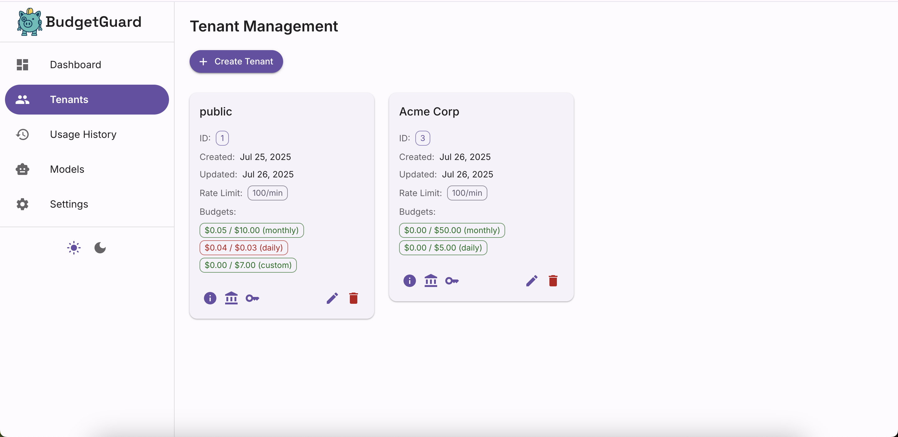
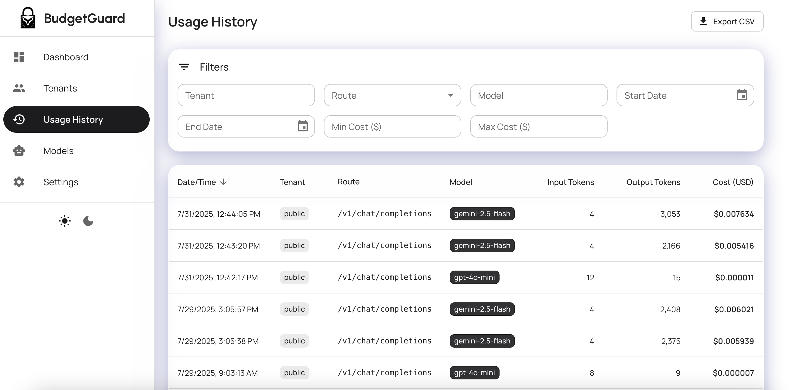
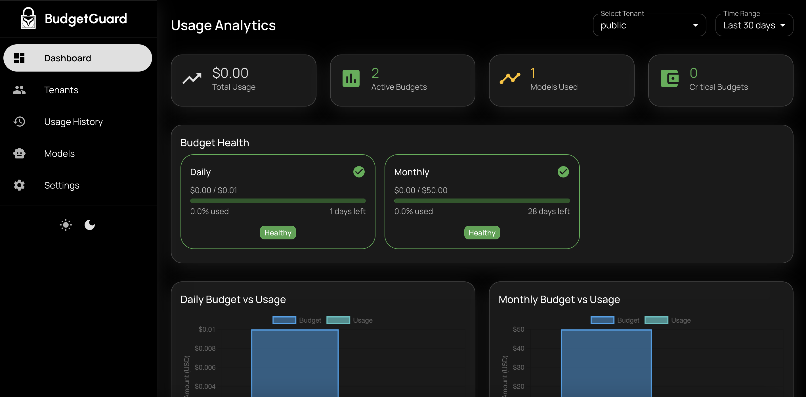

# BudgetGuard Dashboard

<div align="center">


A modern React dashboard for managing the BudgetGuard AI proxy system, built with Material Design 3.

[Live Demo](#screenshots) • [Quick Start](#quick-start) • [API Reference](#api-integration) • [Deployment](#production-deployment)

</div>

## ✨ Features

### 🏠 System Overview
- **Real-time Health Monitoring** - Database, Redis, and AI provider status
- **System Metrics** - Request volumes, response times, error rates
- **Alert Dashboard** - Critical system notifications and warnings
- **Quick Actions** - Common administrative tasks at a glance

### 👥 Tenant Management
- **Tenant List** - View all tenants with search and filtering
- **Tenant Creation** - Add new tenants with budget and rate limit setup
- **Tenant Editing** - Modify tenant settings, budgets, and permissions
- **Bulk Operations** - Mass updates for multiple tenants

### 💰 Budget & Usage Analytics
- **Budget Overview** - Visual budget utilization across all tenants
- **Usage Trends** - Historical usage patterns and forecasting
- **Cost Breakdown** - Per-model and per-tenant cost analysis
- **Budget Alerts** - Configurable threshold notifications

### 🔑 API Key Management
- **Key Generation** - Create tenant-specific API keys
- **Key Rotation** - Secure key lifecycle management
- **Usage Tracking** - Monitor API key usage patterns
- **Permission Control** - Granular access controls per key

### 🎨 User Experience
- **Material Design 3** - Modern, accessible UI components
- **Light/Dark Themes** - Automatic and manual theme switching
- **Responsive Design** - Optimized for desktop, tablet, and mobile
- **Offline Support** - Service worker for offline functionality

## 🚀 Quick Start

### Prerequisites
- Node.js 18+
- BudgetGuard API server running
- Admin API key configured

### 1. Environment Setup

```bash
# Navigate to dashboard directory
cd src/dashboard

# Install dependencies
npm install

# Copy environment template
cp .env.example .env
```

### 2. Configuration

Edit `.env` with your settings:

```env
# API Configuration
VITE_API_BASE_URL=http://localhost:3000
VITE_ADMIN_API_KEY=your-secure-admin-key-here

# Optional: Dashboard Configuration
VITE_APP_TITLE="BudgetGuard Dashboard"
VITE_DEFAULT_THEME=light
VITE_ENABLE_ANALYTICS=false
```

### 3. Development Server

```bash
# Start development server
npm run dev

# Dashboard available at: http://localhost:3001
```

### 4. Production Build

```bash
# Build for production
npm run build

# Or build from project root
cd ../../
npm run build:dashboard
```

## 📱 Screenshots

### Tenant Management

- Tenant list with search/filter
- Budget utilization indicators
- Bulk action controls

### Usage Reports

- Interactive charts
- Cost breakdown by model
- Usage trend analysis

### Dark Theme

- Complete dark mode support
- Consistent Material Design 3 theming

## 🏗️ Architecture

### Tech Stack

| Technology | Purpose | Version |
|------------|---------|---------|
| **React** | UI Framework | 18.x |
| **TypeScript** | Type Safety | 5.x |
| **Material-UI** | Component Library | 5.x |
| **Vite** | Build Tool | 4.x |
| **React Query** | API State Management | 4.x |
| **Zustand** | Global State | 4.x |
| **React Router** | Navigation | 6.x |
| **Chart.js** | Data Visualization | 4.x |

### Project Structure

```
src/dashboard/
├── public/                     # Static assets
│   ├── favicon.ico
│   └── manifest.json
├── src/
│   ├── components/             # Reusable UI components
│   │   ├── common/            # Generic components
│   │   │   ├── LoadingSpinner.tsx
│   │   │   ├── ErrorBoundary.tsx
│   │   │   └── ConfirmDialog.tsx
│   │   ├── charts/            # Chart components
│   │   │   ├── BudgetChart.tsx
│   │   │   ├── UsageChart.tsx
│   │   │   └── MetricsChart.tsx
│   │   ├── dialogs/           # Modal dialogs
│   │   │   ├── CreateTenantDialog.tsx
│   │   │   ├── EditTenantDialog.tsx
│   │   │   └── ManageApiKeysDialog.tsx
│   │   └── layout/            # Layout components
│   │       ├── DashboardLayout.tsx
│   │       ├── Sidebar.tsx
│   │       └── Header.tsx
│   ├── pages/                 # Main dashboard pages
│   │   ├── Overview.tsx       # System health dashboard
│   │   ├── Tenants.tsx        # Tenant management
│   │   ├── Usage.tsx          # Usage analytics
│   │   ├── Models.tsx         # Model pricing management
│   │   ├── Settings.tsx       # System settings
│   │   └── UsageHistory.tsx   # Historical usage data
│   ├── hooks/                 # Custom React hooks
│   │   ├── useApi.ts          # API integration hooks
│   │   ├── useStore.ts        # Global state management
│   │   ├── useTheme.ts        # Theme management
│   │   └── useUsageAnalytics.ts # Analytics hooks
│   ├── services/              # External services
│   │   ├── api.ts             # API client
│   │   └── storage.ts         # Local storage utilities
│   ├── types/                 # TypeScript definitions
│   │   ├── index.ts           # Common types
│   │   ├── api.ts             # API response types
│   │   └── charts.ts          # Chart data types
│   ├── utils/                 # Helper functions
│   │   ├── currency.ts        # Currency formatting
│   │   ├── date.ts            # Date utilities
│   │   └── validation.ts      # Input validation
│   ├── theme.ts               # Material Design 3 theme
│   ├── App.tsx                # Main React app
│   └── main.tsx               # React entry point
├── screenshots/               # Dashboard screenshots
├── .env.example              # Environment template
├── package.json              # Dependencies
├── vite.config.ts            # Vite configuration
├── tsconfig.json             # TypeScript config
└── README.md                 # This file
```

## 🔌 API Integration

### Authentication

The dashboard uses the admin API key for authentication:

```typescript
// Automatic header injection
const apiClient = axios.create({
  baseURL: import.meta.env.VITE_API_BASE_URL,
  headers: {
    'X-Admin-Key': import.meta.env.VITE_ADMIN_API_KEY,
    'Content-Type': 'application/json'
  }
});
```

### API Endpoints Used

| Endpoint | Method | Purpose |
|----------|--------|---------|
| `/health` | GET | System health check |
| `/admin/tenant` | GET, POST | Tenant management |
| `/admin/tenant/:id` | GET, PUT, DELETE | Individual tenant operations |
| `/admin/tenant/:id/budgets` | GET, POST | Budget management |
| `/admin/tenant/:id/apikeys` | GET, POST, DELETE | API key management |
| `/admin/tenant/:id/ratelimit` | GET, PUT | Rate limit configuration |
| `/admin/model-pricing` | GET, POST, PUT | Model pricing management |
| `/admin/usage-ledger` | GET | Usage analytics data |

### Error Handling

```typescript
// Centralized error handling
const handleApiError = (error: AxiosError) => {
  if (error.response?.status === 401) {
    // Redirect to login or show auth error
    showNotification('Authentication failed', 'error');
  } else if (error.response?.status >= 500) {
    // Server error
    showNotification('Server error occurred', 'error');
  } else {
    // Client error
    showNotification(error.message, 'warning');
  }
};
```

## 🎨 Theming & Customization

### Material Design 3 Implementation

```typescript
// theme.ts
export const createTheme = (mode: 'light' | 'dark') => ({
  palette: {
    mode,
    primary: {
      main: '#6750A4',
      light: '#9A82DB',
      dark: '#4F378B',
    },
    secondary: {
      main: '#625B71',
      light: '#958DA5',
      dark: '#4A4458',
    },
    // ... additional palette configuration
  },
  typography: {
    fontFamily: '"Inter", "Roboto", "Helvetica", "Arial", sans-serif',
    // Material Design 3 typography scale
  },
  shape: {
    borderRadius: 12, // Material Design 3 rounded corners
  },
});
```

### Custom Components

```typescript
// Custom themed components
const StyledCard = styled(Card)(({ theme }) => ({
  borderRadius: theme.shape.borderRadius,
  boxShadow: theme.shadows[1],
  transition: theme.transitions.create(['box-shadow']),
  '&:hover': {
    boxShadow: theme.shadows[4],
  },
}));
```

## 🏭 Production Deployment

### Environment Variables

```env
# Production configuration
VITE_API_BASE_URL=https://your-budgetguard-api.com
VITE_ADMIN_API_KEY=your-production-admin-key
VITE_APP_TITLE=BudgetGuard Production
VITE_ENABLE_ANALYTICS=true
VITE_SENTRY_DSN=your-sentry-dsn
```

### Build Optimization

```bash
# Production build with optimizations
npm run build

# Analyze bundle size
npm run build:analyze

# Preview production build
npm run preview
```

### Docker Deployment

```dockerfile
# Multi-stage build for dashboard
FROM node:18-alpine as dashboard-builder
WORKDIR /app/dashboard
COPY src/dashboard/package*.json ./
RUN npm ci --only=production
COPY src/dashboard/ ./
RUN npm run build

FROM nginx:alpine
COPY --from=dashboard-builder /app/dashboard/dist /usr/share/nginx/html
COPY nginx.conf /etc/nginx/nginx.conf
EXPOSE 80
CMD ["nginx", "-g", "daemon off;"]
```

### CDN Integration

```typescript
// vite.config.ts for CDN deployment
export default defineConfig({
  base: 'https://cdn.your-domain.com/budgetguard-dashboard/',
  build: {
    assetsDir: 'assets',
    rollupOptions: {
      output: {
        manualChunks: {
          vendor: ['react', 'react-dom'],
          mui: ['@mui/material', '@mui/icons-material'],
        },
      },
    },
  },
});
```

## 🔧 Development

### Available Scripts

```bash
# Development
npm run dev              # Start dev server
npm run dev:host         # Start with network access

# Building
npm run build            # Production build
npm run build:analyze    # Build with bundle analyzer
npm run preview          # Preview production build

# Code Quality
npm run lint             # ESLint checking
npm run lint:fix         # Auto-fix ESLint issues
npm run type-check       # TypeScript checking
npm run format           # Prettier formatting

# Testing
npm run test             # Run tests
npm run test:ui          # Tests with UI
npm run test:coverage    # Coverage report
```

### Code Standards

- **ESLint** with React and TypeScript rules
- **Prettier** for code formatting
- **Husky** for git hooks
- **TypeScript strict mode** enabled

### Contributing to Dashboard

1. Follow the [main contributing guide](../../CONTRIBUTING.md)
2. Dashboard-specific guidelines:
   - Use Material-UI components when possible
   - Follow Material Design 3 principles
   - Ensure responsive design on all screen sizes
   - Add proper TypeScript types for all props
   - Include error boundaries for robust UX

## 🐛 Troubleshooting

### Common Issues

**Dashboard not loading**
```bash
# Check API connection
curl -H "X-Admin-Key: your-key" http://localhost:3000/health

# Check environment variables
echo $VITE_API_BASE_URL
echo $VITE_ADMIN_API_KEY
```

**Build errors**
```bash
# Clear cache
rm -rf node_modules dist
npm install

# Check TypeScript errors
npm run type-check
```

**API authentication errors**
- Verify admin API key is correct
- Check API server is running
- Ensure CORS is configured properly

### Performance Optimization

```typescript
// Code splitting for better performance
const TenantManagement = lazy(() => import('./pages/Tenants'));
const UsageAnalytics = lazy(() => import('./pages/Usage'));

// Memoization for expensive calculations
const expensiveCalculation = useMemo(() => {
  return calculateUsageMetrics(usageData);
}, [usageData]);
```

## 📊 Analytics & Monitoring

### Built-in Analytics

The dashboard includes optional analytics:

```typescript
// Track user interactions
const trackEvent = (event: string, properties?: object) => {
  if (import.meta.env.VITE_ENABLE_ANALYTICS === 'true') {
    // Send to analytics service
    analytics.track(event, properties);
  }
};
```

### Error Monitoring

```typescript
// Sentry integration for error tracking
if (import.meta.env.PROD) {
  Sentry.init({
    dsn: import.meta.env.VITE_SENTRY_DSN,
    environment: import.meta.env.MODE,
  });
}
```

## 🔮 Roadmap

### Current Features (v1.0)
- ✅ System overview and health monitoring
- ✅ Basic tenant management
- ✅ Material Design 3 theming
- ✅ Responsive design

### Planned Features (v1.1)
- 🔄 Real-time usage charts
- 🔄 Advanced budget management
- 🔄 API key lifecycle management
- 🔄 Custom alerts and notifications

### Future Features (v2.0)
- 📅 Multi-tenant dashboards
- 📅 Advanced analytics and reporting
- 📅 Custom policy management UI
- 📅 Integration with external tools

---

<div align="center">

**Need help?** Check the [main documentation](../../README.md) or [create an issue](https://github.com/budgetguard-ai/budgetguard-core/issues).

[⬆ Back to top](#budgetguard-dashboard)

</div>